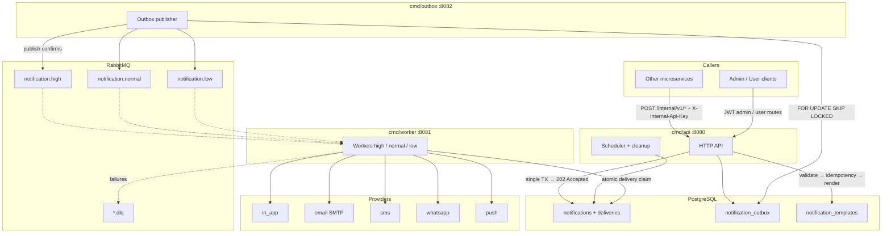
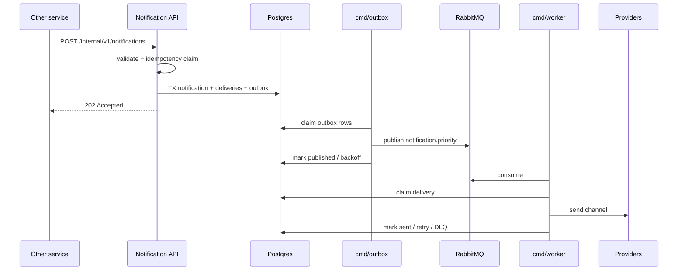

# Notification Service

Template-driven multi-channel notification microservice (In-App, Email, SMS, WhatsApp; Push when configured).

Adding a new domain notification (Withdrawal, Deposit, KYC, …) requires **only**:

1. Inserting templates for the needed `code` / `locale` / `channel`
2. Calling `POST /internal/v1/notifications` with `template_code` + `variables` from the caller service

No new consumers, handlers, or domain imports inside this service.

## Architecture

The API never publishes to RabbitMQ. Acceptance is durable: notification + deliveries + outbox rows are written in one Postgres transaction, then `202 Accepted` is returned. A separate **outbox publisher** claims rows with `FOR UPDATE SKIP LOCKED` and publishes with confirms.





- Templates live in `notification_templates` (`{{amount}}`-style placeholders only; no code execution).
- Contacts for user-targeted commands are supplied by the caller in `contacts` (email, phone, locale, verified flags, preferences); this service does not call User Service.
- OTP / pre-user flows use `POST /internal/v1/direct-notifications` with an explicit recipient.
- Scheduled notifications stay hidden from the user inbox until `scheduled_at`.
- SMS / WhatsApp / Push are accepted in validation only when the provider is actually configured (`Ready()`).

Queues: `notification.high`, `notification.normal`, `notification.low` (+ matching `.dlq`).

## Processes

| Binary | Role | Default health |
|--------|------|----------------|
| `cmd/api` | HTTP API, migrations, scheduler, idempotency cleanup | `:8080` |
| `cmd/outbox` | Outbox → RabbitMQ publisher | `:8082` |
| `cmd/worker` | Consume priority queues | `:8081` |

API readiness checks Postgres only (broker outage must not restart-loop the API). Outbox and workers also check RabbitMQ.

## Layout

```text
cmd/api                         HTTP + scheduler + cleanup
cmd/worker                      Queue consumers
cmd/outbox                      Outbox publisher
internal/notification/          http / service / repo / validator / dto / entity / metrics
internal/notification/template  safe {{var}} renderer
internal/outbox                 publisher loop used by cmd/outbox
internal/provider               email / sms / whatsapp / inapp / push
internal/queue                  RabbitMQ (confirms, mandatory, reconnect)
migrations/postgres             sql-migrate (Up/Down)
infra/grafana | prometheus      dashboards & alerts
```

Shared libs: [`../go-packages`](../go-packages) (`apperr`, `auth`, `db`, `httpserver`, `notificationclient`).

Local module resolution:

```go
replace github.com/mehrdad-masoumi/go-packages => ../go-packages
```

## APIs

### Internal (`X-Internal-Api-Key`)

| Method | Path | Notes |
|--------|------|--------|
| `POST` | `/internal/v1/notifications` | Template command for a `user_id` → `202` |
| `POST` | `/internal/v1/direct-notifications` | One channel + explicit `recipient` (OTP, etc.) |
| `POST` | `/internal/notifications` | **Deprecated** content-based create; still uses outbox |

### Admin (JWT + admin role)

| Method | Path |
|--------|------|
| `POST` | `/admin/notifications` |
| `GET` | `/admin/notifications` |
| `GET` | `/admin/notifications/:id` |
| `GET` | `/admin/notification-batches/:batch_id` |
| `POST` | `/admin/notification-templates` |
| `GET` | `/admin/notification-templates` (filters: `code`, `locale`, `channel`, `enabled`) |
| `GET` | `/admin/notification-templates/:id` |
| `PUT` | `/admin/notification-templates/:id` |
| `PATCH` | `/admin/notification-templates/:id/status` |

### User (JWT; `user_id` from token)

| Method | Path |
|--------|------|
| `GET` | `/notifications` |
| `GET` | `/notifications/unread-count` |
| `PATCH` | `/notifications/:id/read` |
| `POST` | `/notifications/read-all` |

### Health & metrics

- `GET /health-check`
- `GET /ready`
- `GET /metrics` (also on worker `:8081` and outbox `:8082`)

## Sample: template command (preferred)

```http
POST /internal/v1/notifications
X-Internal-Api-Key: change-me-internal-api-key
Content-Type: application/json

{
  "idempotency_key": "withdrawal:123:approved",
  "user_id": "11111111-1111-1111-1111-111111111111",
  "template_code": "withdrawal_approved",
  "locale": "fa",
  "channels": ["in_app", "email"],
  "priority": "high",
  "contacts": {
    "email": "user@example.com",
    "phone": "+49123456789",
    "locale": "fa",
    "email_verified": true,
    "phone_verified": true,
    "preferences": { "email": true, "sms": true, "whatsapp": false }
  },
  "variables": {
    "amount": "1200",
    "currency": "USDT",
    "withdrawal_id": "123"
  },
  "action_url": "/withdrawals/123",
  "scheduled_at": null
}
```

Rules:

- `idempotency_key` required (max 255); same key + different body → `409`
- `contacts` required (email/phone may be empty when only `in_app` / `push` are used)
- `locale` defaults to `contacts.locale`, then `fa`
- empty `channels` → channels from enabled templates for that code
- empty `priority` → template `default_priority`, then `normal`
- response after durable write only — does not wait for provider send

`202 Accepted`:

```json
{
  "id": "aaaaaaaa-bbbb-cccc-dddd-eeeeeeeeeeee",
  "status": "accepted"
}
```

## Sample: direct notification (OTP)

```http
POST /internal/v1/direct-notifications
X-Internal-Api-Key: change-me-internal-api-key
Content-Type: application/json

{
  "idempotency_key": "login-otp:request-123",
  "template_code": "login_otp",
  "locale": "fa",
  "channel": "sms",
  "recipient": "+49123456789",
  "variables": { "code": "123456" }
}
```

## Sample: caller client (`notificationclient`)

```go
import "github.com/mehrdad-masoumi/go-packages/notificationclient"

client := notificationclient.New(notificationclient.Config{
    BaseURL: "http://notification-api:8080",
    APIKey:  os.Getenv("NOTIFICATION_INTERNAL_API_KEY"),
    Timeout: 5 * time.Second,
})

_, err := client.Send(ctx, notificationclient.Command{
    IdempotencyKey: "withdrawal:" + withdrawal.ID.String() + ":approved",
    UserID:         withdrawal.UserID.String(),
    TemplateCode:   "withdrawal_approved",
    Priority:       "high",
    ActionURL:      "/withdrawals/" + withdrawal.ID.String(),
    Contacts: &notificationclient.Contacts{
        Email:         user.Email,
        Phone:         user.Phone,
        Locale:        user.Locale,
        EmailVerified: user.EmailVerified,
        PhoneVerified: user.PhoneVerified,
        Preferences:   user.NotificationPreferences,
    },
    Variables: map[string]any{
        "amount":   withdrawal.Amount.String(),
        "currency": withdrawal.Currency,
    },
})
```

**Do not** fire-and-forget:

```go
// BAD — drops errors and races with request context
go notificationClient.Send(ctx, command)
```

For financial / security operations, write to the **caller's own transactional outbox**, then have a worker call `Send` after commit. See [`../go-packages/README.md`](../go-packages/README.md).

## Config

Prefix: `NOTIFICATION_`.

Convention:

- `__` = nesting (becomes `.`)
- `_` = part of the field name

Examples:

| Env | Config path |
|-----|-------------|
| `NOTIFICATION_AUTH__ACCESS_SECRET` | `auth.access_secret` |
| `NOTIFICATION_INTERNAL_API_KEY` | `internal_api_key` |
| `NOTIFICATION_WORKER__MAX_RETRIES` | `worker.max_retries` |
| `NOTIFICATION_OUTBOX__HEALTH_PORT` | `outbox.health_port` |

In `production` / `prod`, placeholder secrets (`change-me-*`) cause fail-fast on startup. Secrets are never logged.

See `config.yml` and `.env.example`.

## Run locally (Go)

```bash
cd micro-service/notification-service
cp .env.example .env
go mod tidy

# API (runs migrations)
go run ./cmd/api

# Outbox publisher (required for delivery)
go run ./cmd/outbox

# Workers (one or more priorities)
go run ./cmd/worker -queues=high
go run ./cmd/worker -queues=normal
go run ./cmd/worker -queues=low
```

## Docker

Build context is the **parent** `micro-service/` directory (so `replace => ../go-packages` resolves).

```sql
CREATE USER notification WITH PASSWORD 'notification';
CREATE DATABASE notifications OWNER notification;
```

```bash
cd micro-service/notification-service
cp .env.example .env
docker compose -f docker-compose.dev.yml up --build
```

Services: `notification-api`, `notification-outbox`, `notification-worker-{high,normal,low}`.

Default host port: API `8191→8080`.

```bash
docker compose -f docker-compose.dev.yml up --scale notification-worker-high=3
```

Manual image builds from `micro-service/`:

```bash
docker build -f notification-service/Dockerfile --target api -t notification-api .
docker build -f notification-service/Dockerfile --target worker -t notification-worker .
docker build -f notification-service/Dockerfile --target outbox -t notification-outbox .
```

## Tests

```bash
go test ./...
go vet ./...

# Integration (needs Postgres DSN; excluded from default suite)
NOTIFICATION_TEST_POSTGRES_DSN='host=localhost user=notification password=notification dbname=notifications sslmode=disable' \
  go test -tags=integration ./internal/notification/repository/...
```

Unit coverage includes: config env mapping, template rendering, validators, backoff, provider disabled≠sent, registry `Ready()` gating, worker classification, `notificationclient` status mapping.

CI (`.github/workflows/ci.yml`): `go test`, `go test -race`, `go vet`, `staticcheck`, `govulncheck`, Docker builds for `api` / `worker` / `outbox`.

## Observability

Metrics (low-cardinality labels only):

- `notification_commands_total`
- `notification_outbox_pending` / `notification_outbox_publish_total` / `notification_outbox_oldest_pending_seconds`
- `notification_delivery_total` / `notification_delivery_duration_seconds`
- `notification_retry_total` / `notification_dlq_total`
- `notification_template_render_errors_total`
- `notification_idempotency_conflicts_total`

Dashboard: [`infra/grafana/dashboards/notification.json`](infra/grafana/dashboards/notification.json)  
Alerts: [`infra/prometheus/alerts/notification.yml`](infra/prometheus/alerts/notification.yml)

Logs are structured around `notification_id`, `delivery_id`, `template_code`, `channel`, `priority`, `attempt`. Do not log email, phone, OTP, tokens, or API keys.

## Provider status

| Channel | Status |
|---------|--------|
| `in_app` | Always available |
| `email` | SMTP when `email.host` is set |
| `sms` / `whatsapp` / `push` | Only when provider config is `Ready()`; otherwise rejected at validation |

## Migrations

Applied automatically on API startup (`MIGRATIONS_DIR`, default `./migrations/postgres`).

Notable migrations after the baseline:

- `notification_templates`
- `notification_outbox`
- template fields on `notifications`
- `notification_batch_jobs` (async admin batches when recipients > `batch.sync_max_recipients`, default 100)
