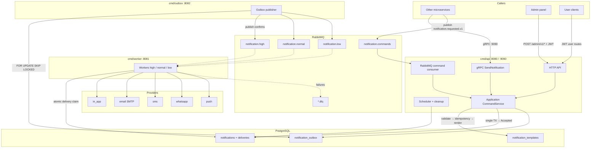
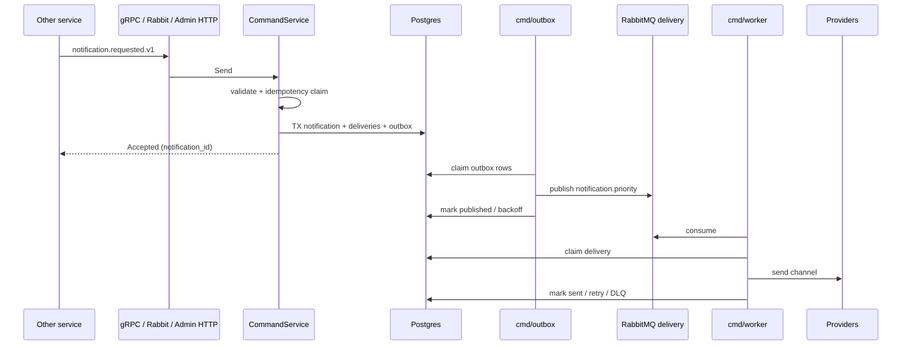

# Notification Service

Template-driven multi-channel notification microservice (In-App, Email, SMS, WhatsApp; Push when configured).

Adding a new domain notification (Withdrawal, Deposit, KYC, …) requires **only**:

1. Inserting templates for the needed `code` / `locale` / `channel`
2. Sending a `notification.requested.v1` command (gRPC or RabbitMQ) with `template_code` + `variables` + recipient contacts

No new consumers, handlers, or domain imports inside this service.

**Preferred ingress for other services:** gRPC or RabbitMQ via [`../broker-contract`](../broker-contract) (`notification.requested.v1`).  
**Admin panel:** `POST /admin/v1/notifications` (template-driven).  

## Architecture

All transports enter the same **application command service**. Acceptance is durable: notification + deliveries + outbox rows are written in one Postgres transaction, then `Accepted` is returned. The API never publishes delivery jobs to RabbitMQ — a separate **outbox publisher** claims rows with `FOR UPDATE SKIP LOCKED` and publishes with confirms.





- Contract source of truth: [`../broker-contract`](../broker-contract) (proto + JSON Schema). Callers must supply full recipient contacts; this service does **not** call User Service.
- Templates live in `notification_templates` (`{{amount}}`-style placeholders only; no code execution).
- OTP / pre-user flows: use gRPC/Rabbit with email/SMS recipient (no `user_id`).
- Scheduled notifications stay hidden from the user inbox until `scheduled_at`.
- SMS / WhatsApp / Push are accepted in validation only when the provider is actually configured (`Ready()`).

**Delivery queues:** `notification.high`, `notification.normal`, `notification.low` (+ matching `.dlq`).

**Command ingress (RabbitMQ):**

| Resource | Name |
|----------|------|
| Exchange | `notification.commands` |
| Routing key | `notification.requested.v1` |
| Queue | `notification-service.requested.v1` |
| DLX / DLQ | `notification.dlx` / `notification-service.requested.v1.dlq` |

## Processes

| Binary | Role | Default health |
|--------|------|----------------|
| `cmd/api` | HTTP API, migrations, scheduler, idempotency cleanup; optional gRPC (`:9090`) + RabbitMQ command consumer | `:8080` |
| `cmd/outbox` | Outbox → RabbitMQ delivery publisher | `:8082` |
| `cmd/worker` | Consume priority delivery queues | `:8081` |

API readiness checks Postgres only (broker outage must not restart-loop the API). Outbox and workers also check RabbitMQ. gRPC exposes standard gRPC health when enabled.

## Layout

```text
cmd/api                              HTTP + gRPC + command consumer + scheduler
cmd/worker                           Delivery queue consumers
cmd/outbox                           Outbox publisher
internal/application/notification    Shared CommandService (all transports)
internal/transport/                  grpc / http (admin v1) / rabbitmq consumer
internal/notification/               http / service / repo / validator / dto / entity / metrics
internal/notification/template       safe {{var}} renderer
internal/outbox                      publisher loop used by cmd/outbox
internal/provider                    email / sms / whatsapp / inapp / push
internal/queue                       RabbitMQ delivery (confirms, mandatory, reconnect)
migrations/postgres                  sql-migrate (Up/Down)
infra/grafana | prometheus           dashboards & alerts
```

Shared modules:

- [`../broker-contract`](../broker-contract) — `notification.requested.v1` proto + JSON Schema
- [`../go-packages`](../go-packages) — `apperr`, `auth`, `db`, `httpserver`

Local module resolution (see `go.mod`):

```go
replace github.com/mehrdad-masoumi/broker-contract => ../broker-contract
replace github.com/mehrdad-masoumi/go-packages => ../go-packages
```

## Transports (preferred)

### gRPC — sync accept

Use when you need `notification_id` immediately, sync validation errors, or OTP/security flows.

```text
notification.v1.NotificationService/SendNotification
```

Default listen: `:9090` (`transport.grpc`). In Docker, do **not** publish `9090` on the public host — reach via Traefik `grpc-internal` (see `.env.example`).

### RabbitMQ — async command

Use when the producer must not depend on Notification Service availability at call time.

- Body: JSON matching `notification.requested.v1` (see broker-contract schema)
- Content-Type: `application/json`
- Topology: table above (`transport.rabbitmq`)

Both share the same semantic contract and the same durable outcome inside `CommandService`. Details and examples: [`../broker-contract/README.md`](../broker-contract/README.md).

### Choosing transport

| Prefer | When |
|--------|------|
| **gRPC** | Need Accepted + `notification_id`; OTP / security; sync validation |
| **RabbitMQ** | Fire-and-forget after your own outbox; buffering / throughput |
| **Admin HTTP** | Admin panel UI only (`/admin/v1`) |

## HTTP APIs

### Admin v1 (JWT + admin role) — preferred admin create

Enabled when `transport.http.enabled` (default `true`).

| Method | Path | Notes |
|--------|------|--------|
| `POST` | `/admin/v1/notifications` | Template create for one recipient → `202` |
| `POST` | `/admin/v1/notification-batches` | Fan-out to `recipients[]` → `202` |
| `GET` | `/admin/v1/notifications` | List |
| `GET` | `/admin/v1/notifications/:id` | Detail + deliveries |
| `GET` | `/admin/v1/notification-batches/:batch_id` | Batch detail |
| `POST` | `/admin/v1/notification-templates` | Template CRUD |
| `GET` | `/admin/v1/notification-templates` | Filters: `code`, `locale`, `channel`, `enabled` |
| `GET` | `/admin/v1/notification-templates/:id` | |
| `PUT` | `/admin/v1/notification-templates/:id` | |
| `PATCH` | `/admin/v1/notification-templates/:id/status` | |


### User (JWT; `user_id` from token)

| Method | Path |
|--------|------|
| `GET` | `/notifications` |
| `GET` | `/notifications/unread-count` |
| `PATCH` | `/notifications/:id/read` |
| `POST` | `/notifications/read-all` |

### Health & metrics

- `GET /health-check`
- `GET /ready`
- `GET /metrics` (also on worker `:8081` and outbox `:8082`)

## Sample: contract command (preferred)

Semantic twin for gRPC protobuf and RabbitMQ JSON:

```json
{
  "version": "v1",
  "message_id": "550e8400-e29b-41d4-a716-446655440000",
  "idempotency_key": "withdrawal:123:approved",
  "source_service": "withdrawal-service",
  "template_code": "withdrawal_approved",
  "locale": "fa",
  "recipient": {
    "user_id": "11111111-1111-1111-1111-111111111111",
    "email": "user@example.com",
    "phone": "+49123456789",
    "display_name": "Mehrdad"
  },
  "channels": ["in_app", "email"],
  "variables": {
    "amount": "1200",
    "currency": "USDT",
    "withdrawal_id": "123"
  },
  "metadata": {
    "withdrawal_id": "123"
  },
  "scheduled_at": null
}
```

Rules:

- `idempotency_key` required; same key + different body → conflict / `409`
- caller supplies full `recipient` contacts (email/phone may be empty when only `in_app` / `push`)
- empty `channels` → derived from enabled templates for that code (where applicable)
- response after durable write only — does **not** wait for provider send

For financial / security operations, write to the **caller's own transactional outbox**, then publish to `notification.requested.v1` or call gRPC after commit.

## Sample: Admin v1 create

```http
POST /admin/v1/notifications
Authorization: Bearer <admin-jwt>
Content-Type: application/json

{
  "idempotency_key": "admin:campaign:42:user:11111111-1111-1111-1111-111111111111",
  "template_code": "system_announcement",
  "locale": "fa",
  "channels": ["in_app", "email"],
  "priority": "normal",
  "recipient": {
    "user_id": "11111111-1111-1111-1111-111111111111",
    "email": "user@example.com",
    "phone": "+49123456789"
  },
  "variables": {
    "title": "Maintenance",
    "body": "Scheduled window tonight"
  }
}
```

`202 Accepted`:

```json
{
  "notification_id": "aaaaaaaa-bbbb-cccc-dddd-eeeeeeeeeeee",
  "status": "accepted"
}
```

Batch: `POST /admin/v1/notification-batches` with `recipients: [...]` → `{ "batch_id", "notification_id", "status": "accepted" }`.

## Config

Prefix: `NOTIFICATION_`.

Convention:

- `__` = nesting (becomes `.`)
- `_` = part of the field name

Examples:

| Env | Config path |
|-----|-------------|
| `NOTIFICATION_AUTH__ACCESS_SECRET` | `auth.access_secret` |
|| `NOTIFICATION_WORKER__MAX_RETRIES` | `worker.max_retries` |
| `NOTIFICATION_OUTBOX__HEALTH_PORT` | `outbox.health_port` |
| `NOTIFICATION_TRANSPORT__GRPC__ENABLED` | `transport.grpc.enabled` |
| `NOTIFICATION_TRANSPORT__GRPC__ADDRESS` | `transport.grpc.address` |
| `NOTIFICATION_TRANSPORT__RABBITMQ__ENABLED` | `transport.rabbitmq.enabled` |
| `NOTIFICATION_TRANSPORT__HTTP__ENABLED` | `transport.http.enabled` |

`transport` defaults (see `config.yml`):

| Key | Default |
|-----|---------|
| `transport.grpc.enabled` / `address` | `true` / `:9090` |
| `transport.rabbitmq.*` | command exchange/queue topology above |
| `transport.http.enabled` | `true` (Admin v1 create routes) |

In `production` / `prod`, placeholder secrets (`change-me-*`) cause fail-fast on startup. Secrets are never logged.

See `config.yml` and `.env.example`.

## Run locally (Go)

```bash
cd micro-service/notification-service
cp .env.example .env
go mod tidy

# API (migrations + HTTP; gRPC/Rabbit consumer if transport.* enabled)
go run ./cmd/api

# Outbox publisher (required for delivery)
go run ./cmd/outbox

# Workers (one or more priorities)
go run ./cmd/worker -queues=high
go run ./cmd/worker -queues=normal
go run ./cmd/worker -queues=low
```

## Docker

Build context is the **parent** `micro-service/` directory (so `replace => ../…` resolves).

```sql
CREATE USER notification WITH PASSWORD 'notification';
CREATE DATABASE notifications OWNER notification;
```

```bash
cd micro-service/notification-service
cp .env.example .env
docker compose -f docker-compose.dev.yml up --build
```

Services: `notification-api`, `notification-outbox`, `notification-worker-{high,normal,low}`.

Default host port: API HTTP `8191→8080`. gRPC `:9090` is **not** published on the host (Traefik `grpc-internal` only).

```bash
docker compose -f docker-compose.dev.yml up --scale notification-worker-high=3
```

Manual image builds from `micro-service/`:

```bash
docker build -f notification-service/Dockerfile --target api -t notification-api .
docker build -f notification-service/Dockerfile --target worker -t notification-worker .
docker build -f notification-service/Dockerfile --target outbox -t notification-outbox .
```

## Tests

```bash
go test ./...
go vet ./...

# Integration (needs Postgres DSN; excluded from default suite)
NOTIFICATION_TEST_POSTGRES_DSN='host=localhost user=notification password=notification dbname=notifications sslmode=disable' \
  go test -tags=integration ./internal/notification/repository/...
```

Unit coverage includes: config env mapping, template rendering, validators, backoff, provider disabled≠sent, registry `Ready()` gating, worker classification, application command mapping.

CI (`.github/workflows/ci.yml`): `go test`, `go test -race`, `go vet`, `staticcheck`, `govulncheck`, Docker builds for `api` / `worker` / `outbox`.

## Observability

Metrics (low-cardinality labels only):

- `notification_accepted_total` / `notification_enqueued_total`
- `notification_commands_total`
- `notification_outbox_pending` / `notification_outbox_publish_total` / `notification_outbox_oldest_pending_seconds`
- `notification_delivery_total` / `notification_delivery_duration_seconds`
- `notification_retry_total` / `notification_dlq_total`
- `notification_scheduler_claimed_total`
- `notification_template_render_errors_total`
- `notification_idempotency_conflicts_total`
- `notification_errors_total`

Dashboard: [`infra/grafana/dashboards/notification.json`](infra/grafana/dashboards/notification.json)  
Alerts: [`infra/prometheus/alerts/notification.yml`](infra/prometheus/alerts/notification.yml)

Logs are structured around `notification_id`, `delivery_id`, `template_code`, `channel`, `priority`, `attempt`. Do not log email, phone, OTP, tokens, or API keys.

## Provider status

| Channel | Status |
|---------|--------|
| `in_app` | Always available |
| `email` | SMTP when `email.host` is set |
| `sms` / `whatsapp` / `push` | Only when provider config is `Ready()`; otherwise rejected at validation |

## Migrations

Applied automatically on API startup (`MIGRATIONS_DIR`, default `./migrations/postgres`).

Notable migrations after the baseline:

- `notification_templates`
- `notification_outbox`
- template fields on `notifications`
- `notification_batch_jobs` (async admin batches when recipients > `batch.sync_max_recipients`, default 100)
